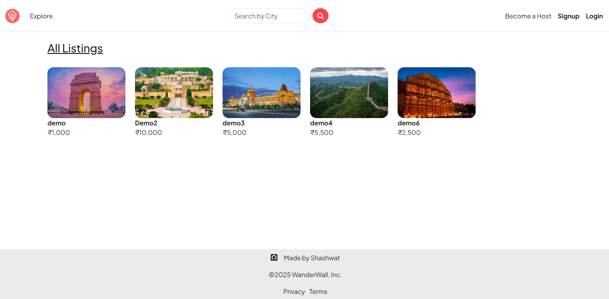
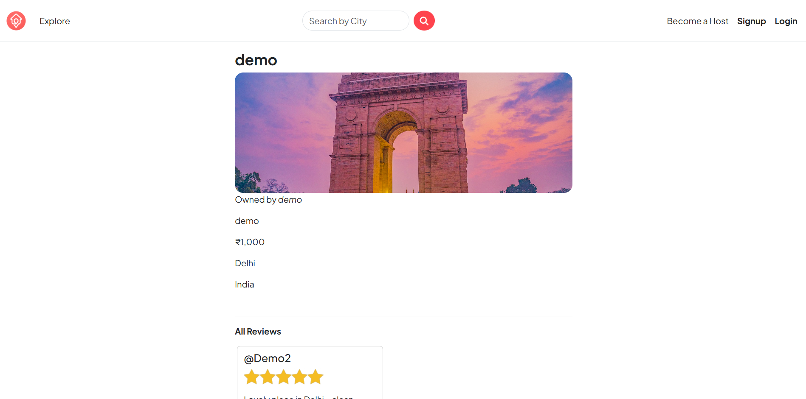
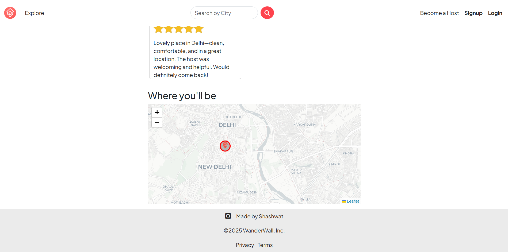
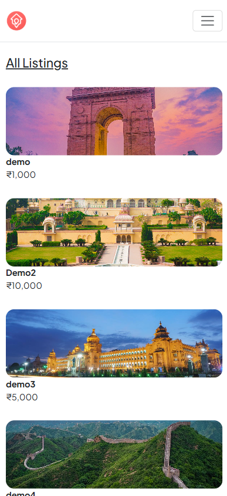
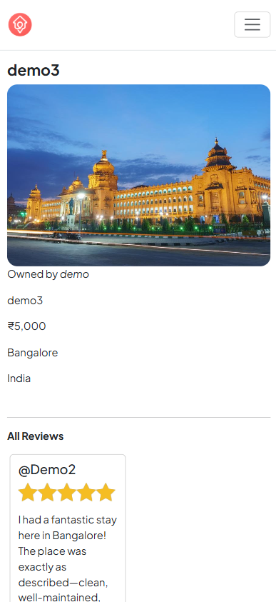
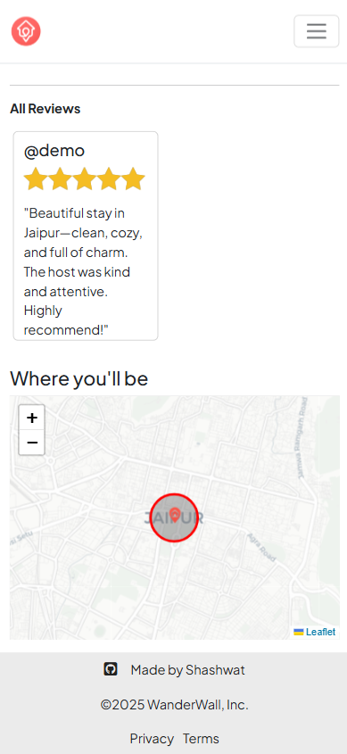

# Wanderwall

A web application inspired by Airbnb, built for **learning and hands-on full-stack practice**. Wanderwall lets users view, add, and review location-based listings with interactive maps.

---

## Key Features

- User authentication using Passport.js with session storage
- CRUD operations for listings (create, read, update, delete)
- Review system for each listing
- Interactive maps using Leaflet and Nominatim for geocoding
- Responsive design with Bootstrap
- RESTful routing with Express.js and EJS templating
- MVC architecture for organized, scalable code
- Custom error handling and wrapAsync utility for cleaner async code

---

## Tech Stack

- Frontend: EJS, Bootstrap
- Backend: Node.js, Express.js
- Database: MongoDB (Mongoose)
- Authentication: Passport.js with session storage
- Maps & Geocoding: Leaflet, Nominatim
- Architecture: MVC pattern

---

## Installation & Setup

1. Clone the repository:
   git clone <your-repo-url>
   cd wanderwall

2. Install dependencies:
   npm install

3. Create a `.env` file in the root directory with the following content:
   CLOUD_NAME=<your-cloudinary-name>
   CLOUD_API_KEY=<your-cloudinary-API-KEY>
   CLOUD_API_SECRET=<your-cloudinary-API-secret>
   ATLASDB_URL=<your-mongodb-uri>
   SECRET=<your-session-secret>

4. Start the server:
   node app.js

5. Open your browser and visit: http://localhost:8080

---

## Usage

- Sign up or log in to manage listings
- Add new locations with addresses (auto-geocoded on the map)
- View interactive maps for each listing
- Leave reviews for listings
- Fully responsive on desktop and mobile

---

## Screenshots / Demo

### Desktop View

### Mobile View

---

## Learning Outcomes

- Node.js & Express.js RESTful APIs
- Session-based authentication with Passport.js
- CRUD operations with MongoDB & Mongoose
- Dynamic frontend rendering using EJS
- Interactive maps with Leaflet & Nominatim
- MVC architecture and modular project organization
- Custom error handling and async utilities

---

## License

This project is for **practice and learning purposes only**.

**Made By Shashwat**
